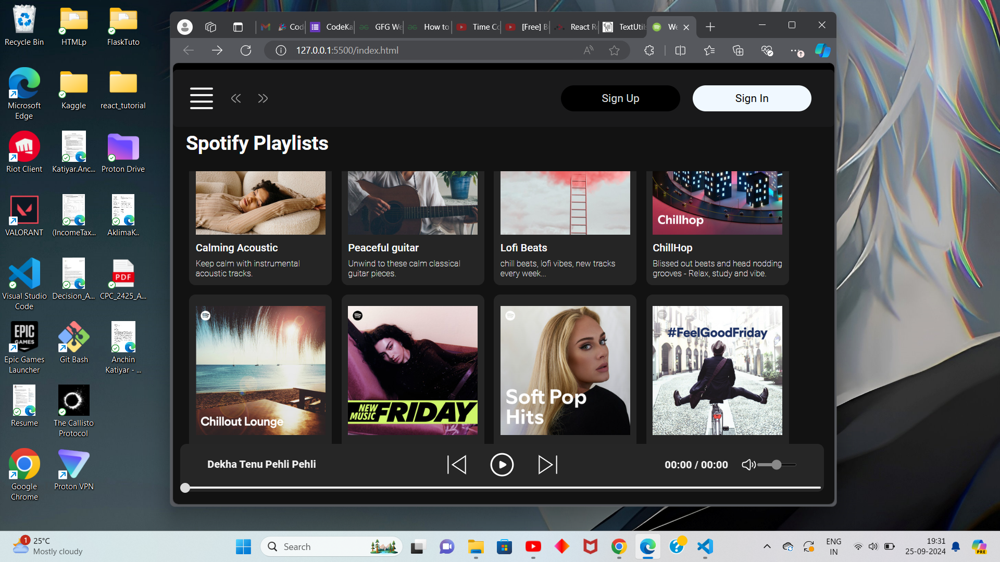

# Web Music Player

## Project Overview
The **Web Music Player** is a simple, responsive music player built with **HTML**, **CSS**, **JavaScript**, and **Bootstrap**. It allows users to browse and play music files from predefined playlists, offering controls such as play, pause, previous, next, and volume adjustment. This project mimics some features of popular music streaming services, featuring a clean and intuitive UI.

## Features
- **Responsive Design**: The player adapts to different screen sizes, making it usable on both desktops and mobile devices.
- **Playlists**: Browse and select songs from different playlists.
- **Playback Controls**: Includes buttons for play, pause, next, and previous, as well as a seek bar and volume control.
- **Dynamic Song Display**: Displays the currently playing song's information and elapsed time in the playbar.
- **Volume Control & Mute**: Users can adjust the volume and mute/unmute directly from the interface.
- **Hamburger Menu**: A collapsible side menu with navigation options.
- **Dark Mode UI**: Styled with a sleek, dark theme for a better user experience.

## Technologies Used
- **HTML/CSS**: For structure and styling.
- **JavaScript**: To handle playlist management, song playback, and user interactions.
- **Bootstrap**: For responsive design and styling.
- **Google Fonts**: Custom fonts for a modern look and feel.

## How It Works
1. **Song Selection**: Users can browse through available playlists and select a song to play.
2. **Playback Controls**: The playbar at the bottom provides control over song playback, with options to play/pause, skip to the next or previous track, and adjust the volume.
3. **Dynamic Updates**: As the song plays, the seek bar updates in real-time, showing the elapsed and total time of the song.
4. **Album Display**: Playlists are displayed as album cards, showing cover art and a brief description.

## How to Run the Project
1. Clone the repository:
   ```bash
   git clone <repository_url>

### How It Looks





